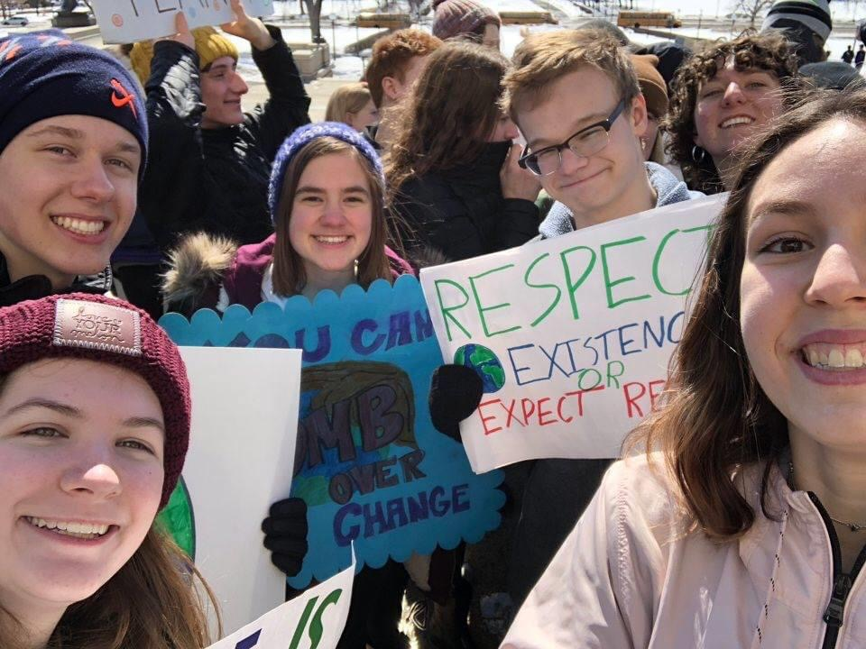

# Projects and Exercises
## Introduction
Hi! My name is Skyler Seets and I'm from Minnetonka, Minnesota, though my family recently moved to College Station, Texas. Academically, I am interested studying human behavior through a STEM perspective, though I don't know yet what I want to major in. Outside of school, I am interested in legislative climate change issues and play the alto sax and piano. 

These are my assignments for DATA100: 

1. [Plot of Running Boy](exercise1.md)
2. [Complex Plot](exercise2.md)
3. [Challenge Plot](exercise3.md)
