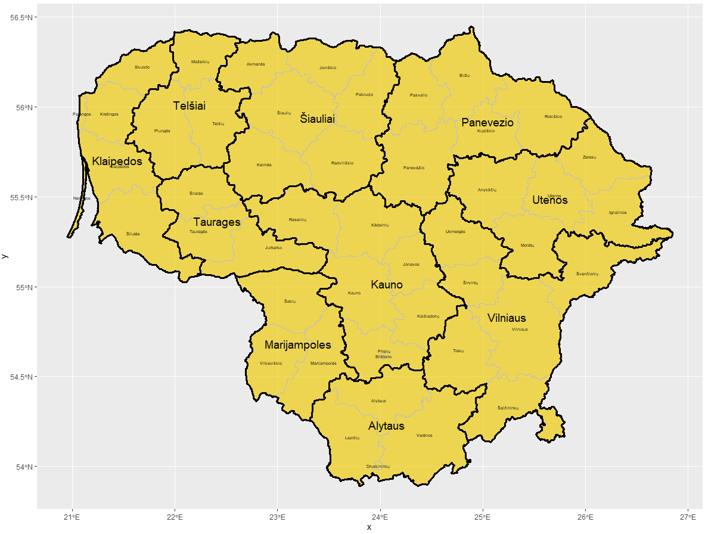

# Project 3 Part 1

First I chose a country, Lithuania, to map. Then, I downloaded information regarding the different regions from the GADM website and imported them into RStudio. Next, I created the graph using the ggplot function, setting line weights and colors so that both the adm1 regions and adm2 regions can be distinguishable. Finally, I added in text in order to label these regions and produced the final image below. 

