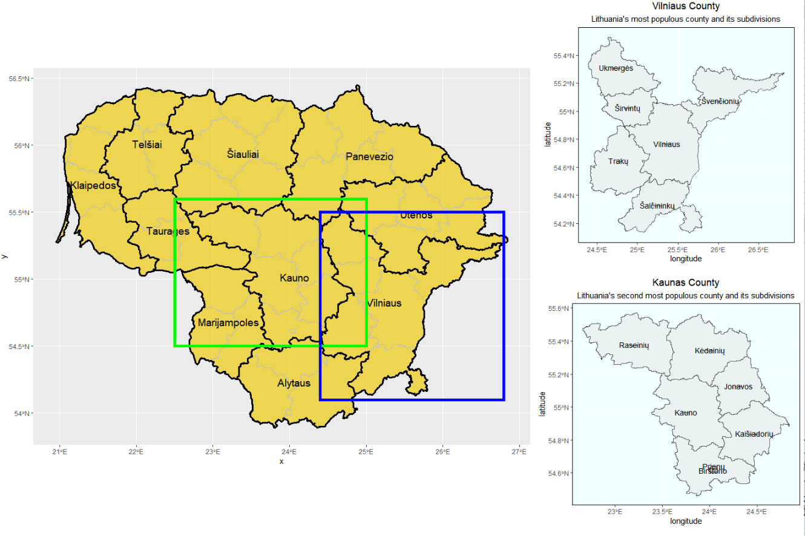

# Project 3 Part 1

First I chose a country, Lithuania, to map. Then, I downloaded information regarding the different regions from the GADM website and imported them into RStudio. Next, I created the graph using the ggplot function, setting line weights and colors so that both the adm1 regions and adm2 regions can be distinguishable. Finally, I added in text in order to label these regions and produced the final image below. 

# Stretch Goal 2

For this part, I created a detail map including the main country map from part 1 and the two detail maps from part 2. First, I created objects of each plot and labelled them. I also added two lines to the first plot to create rectangules around the counties that I would be highlighting. In order to do this, I added the argument geom_rect and inputed the x and y coordinate values corresponding to each county in order to describe the size and placement of the rectangles. Then, I created a ggplot of the three plots, noting their sizing and positioning with relation to each other to create the below plot. 

