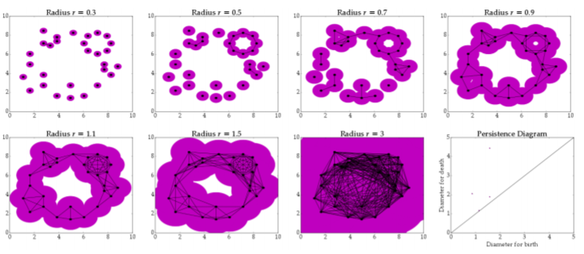

# Data Science Reflection 3: Topographical Data Analysis

An emerging AI tool is called topological data analysis, or TDA, and has been used within the field of experimental and behavioral economics research. The goals of AI within behavioral economics are in order to aid in decision-making processes, behavior prediction and analysis, and optimization of policies, strategies, and choices. Topological Data Analysis uses a topology method, meaning that it optimizes material layout within a space for a given set of conditions and constraints in order to maximize performance of the system, that is applied to data sets and configured to treat data sets as topological spaces. It essentially studies the shape of the data. This is useful as it allows for ease of describing, quantifying, and comparing these “spaces” of data sets and noting interactions between two or more features. It is able to convert “noisy” data sets into something easier to analyze. 
There are two main concepts involved in this process. The first is called persistent homology. This is a complex method that looks at how the representation of data changes as we change the value of the threshold for a given feature. It functions to cut down on the noise and instead find persistent features that are more likely to represent true features of the data (rather than just “noise” or irrelevant and extraneous information). This helps to not only better analyze the data, but aids researchers in studying the fundamental and correlated shapes of data and the evolution of these shapes throughout time. It also allows researchers to find more complex elements of the structure, such as loops and voids. 

The second concept is topological simplification, also known as Mapper. The goal of this method is to form a sort of topological skeleton that highlights differences in structure and function of behavioral pathways. It is important in order to select features that will be used for classification and filtering of data. This is a good tool for visualizing data, as it constructs a 1-dimensional model of the structure of the data. 

Sources:
https://link.springer.com/article/10.1007/s11299-020-00226-4
https://en.wikipedia.org/wiki/Persistent_homology
https://towardsdatascience.com/persistent-homology-with-examples-1974d4b9c3d0
https://files.eric.ed.gov/fulltext/EJ1149275.pdf

Images from:
https://files.eric.ed.gov/fulltext/EJ1149275.pdf
