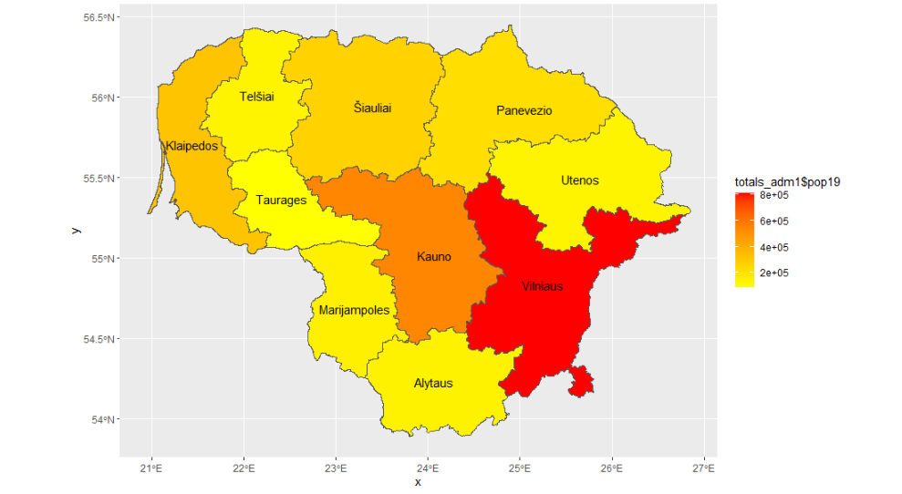
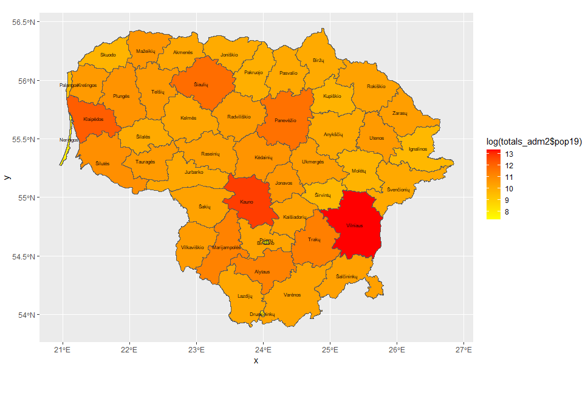
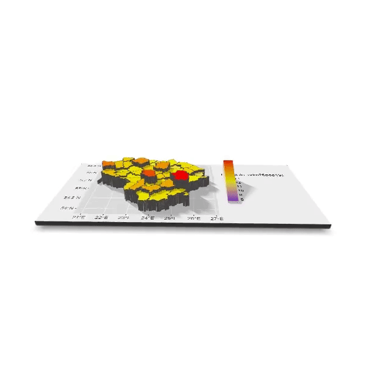

# Project 4
## Part 1

The first plot that I made was a map of the adm1 regions of Lithuania, colored based on their populations. In order to do this, I first used data regarding the population values of Lithuania, as well as the regions and their names. I used the beginCluster and raster functions in order to combine and correlate this information. Then, I plotted this, setting the color boundaries for yellow on the low end and red on the high end to indicate the relative population values for each region to produce the map below. 

## Stretch Goal One
For the next part of this project, I did the same method, except I used the log of the values for the adm2 regions this time in order to make a more specific population map. 

## Stretch Goal Two
For this part, I did a similar method to the last, however this time I combined the colored regions of adm2, adding in a third midpoint color (blue to yellow to red with a midpoint value of 10), along with the bolder outline of adm1. In addition, I included the adm1 names as well with an alpha of 0.35 so they did not conflict with those of adm2. Finally, I added a title, subtitle, and a background color. 

## Stretch Goal Three
The last part of this challenge was to create a rotating 3-D image. For this section, I downloaded the rgl and rayshader packages. After creating an object indicating the information I wanted plotted, I used the plot_gg and render_movie functions to create a rotating 3-D image, before finally converting it into a gif using an online editor.

