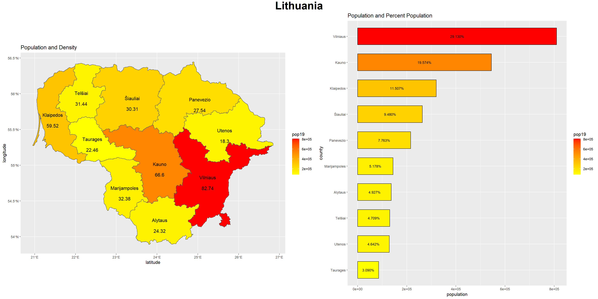
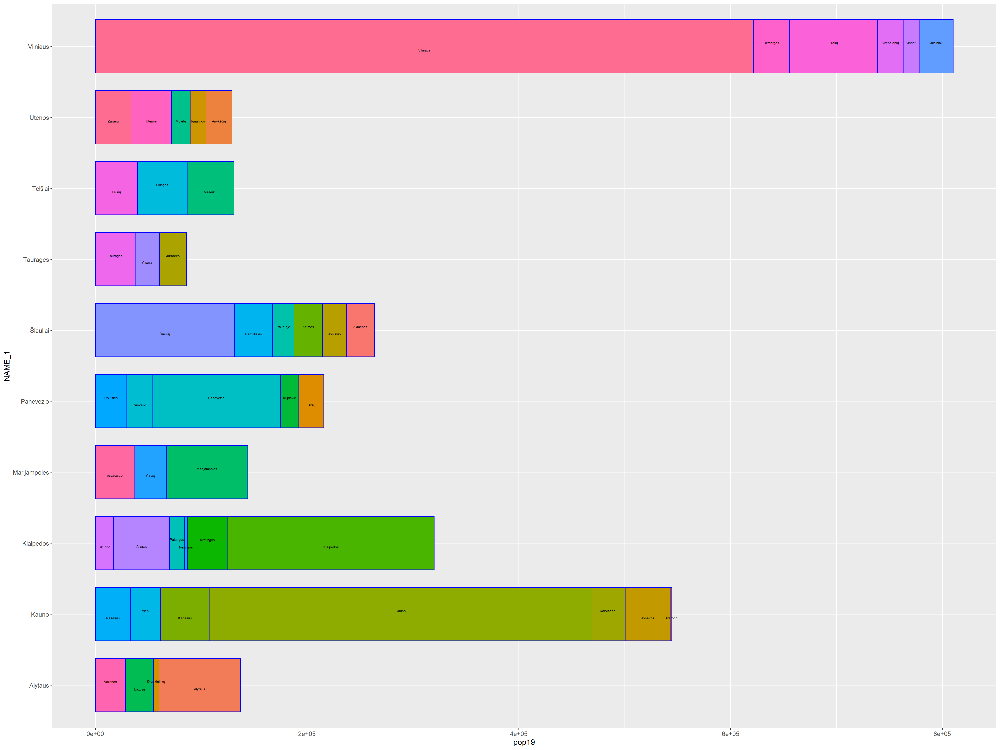

# Project 4 Part 2

For the first deliverable, I created a bar plot to show the distribution of the population between each region in Lithuania. I started by adding additional columns to my adm1 object, representing area and density. Then, I created a bar plot that indicated each of their regions and their population, adding on their percentage population as well. I ordered these to go from greatest to least. Then I added a command of scale_fill_gradient to color the bars in relation to their relative population. Next, I used the population graph that I made in a previous exercise, adding on the population density information that I calculated earlier. Finally, I put the two plots side by side. 

For the stretch goal, I transitioned to looking at the breakup of population of the adm2 regions within each adm1 region. I used various functions, including geom_text_repel and geom_bar in order to create this breakup and ensure that each adm2 region is labeled accordingly. 

