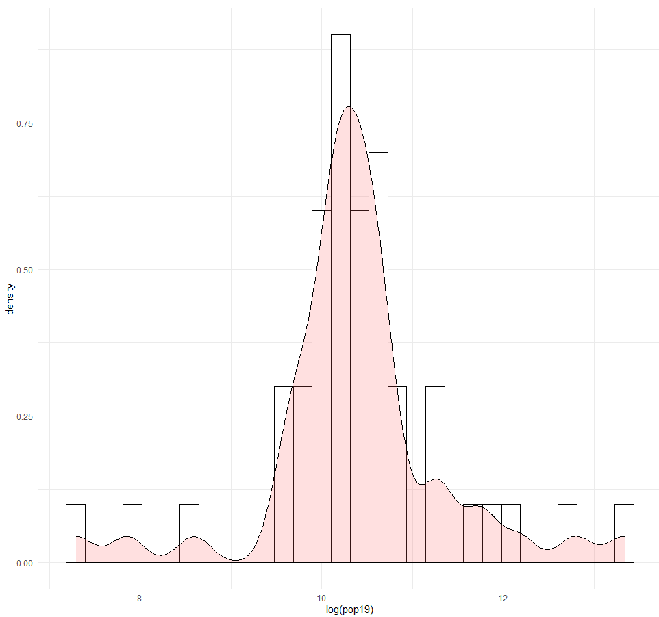
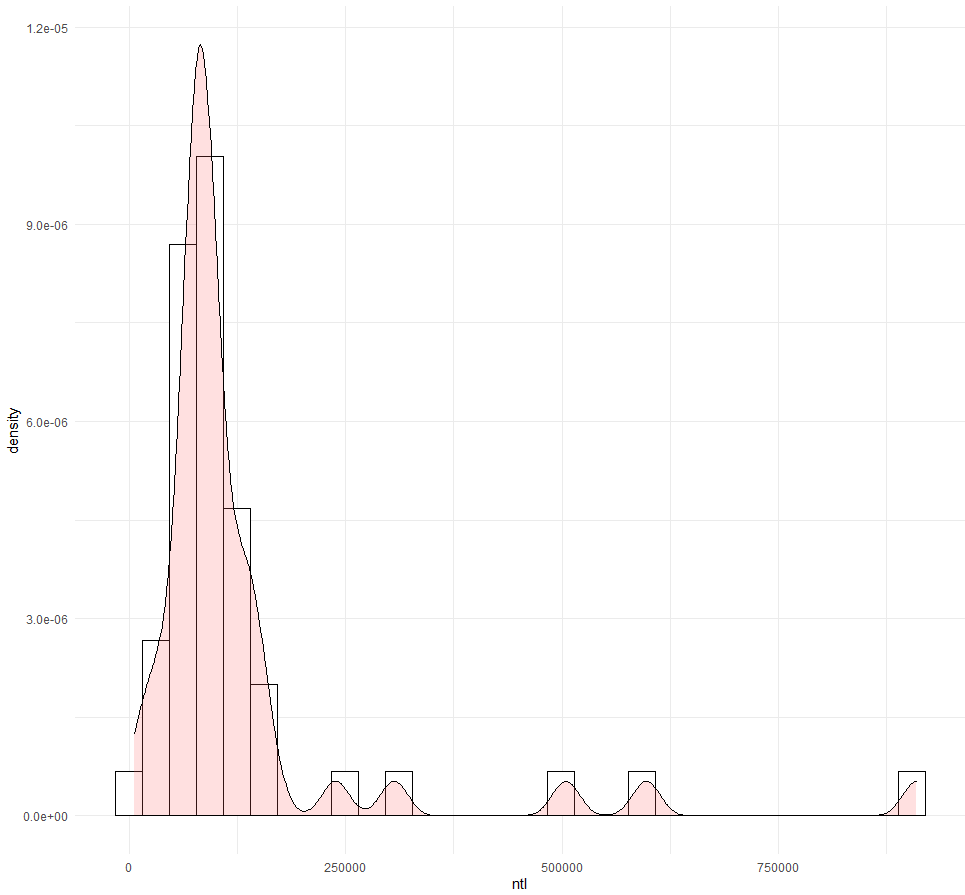

# Project 5

For this project, I began first by importing data to describe various variables from 2015 in Lithuania. Then, I imported these into RStudio, using the function list.files() to import only those I wanted and stack() and raster() to create the object. After renaming the various data sets and importing the remaining files (and adding them to my existing object), I then worked on plotting the information. I created an object to pair all of this data with my existing data on adm2 and saved it. Then, I created two plots. The first is a combination of a bars of a histogram with a line to look at the log of the population. The second, I looked at the variable ntl, which describes night time lights.

