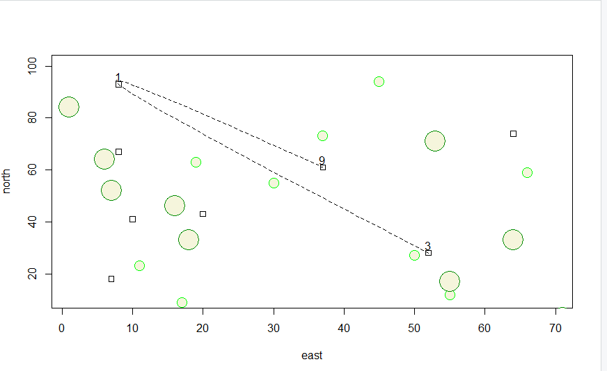

# Exercise 2: Complex Plot

I increased the size of x to be 1:100 and y to be 100:1 and set up the definitions of two axes, east and north, to draw a random sample of 10 points from x and y respectively. Then, I created three different types of symbols: a set of squares, green circles, and slightly larger filled circles, to plot various randomly sampled coordinates. Finally, I used xspline and the dwellings in order to create a spline (or curved path) between three different points to represent the path of the traveller, finishing by using the text function to label these three points. 

