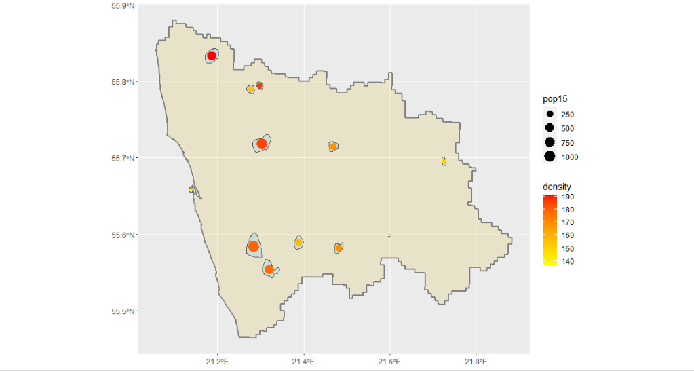
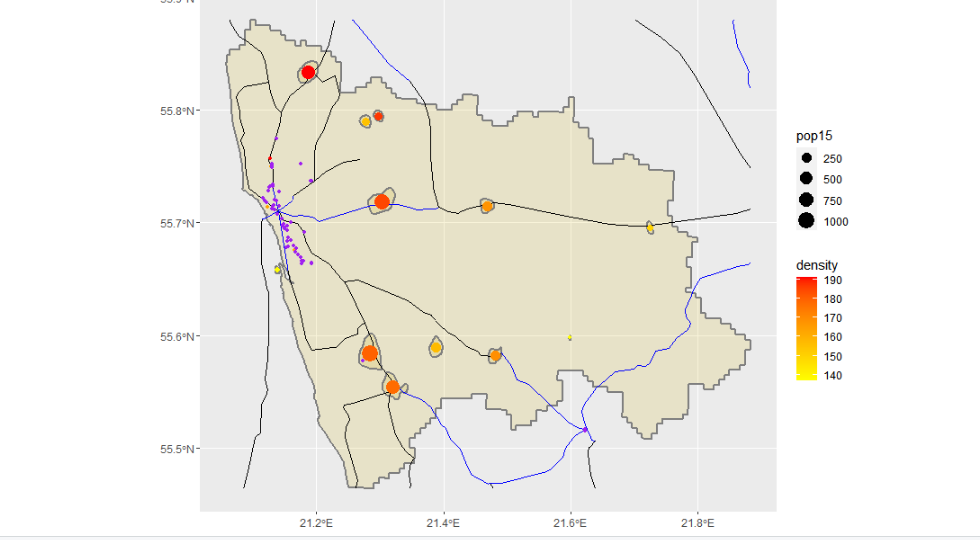
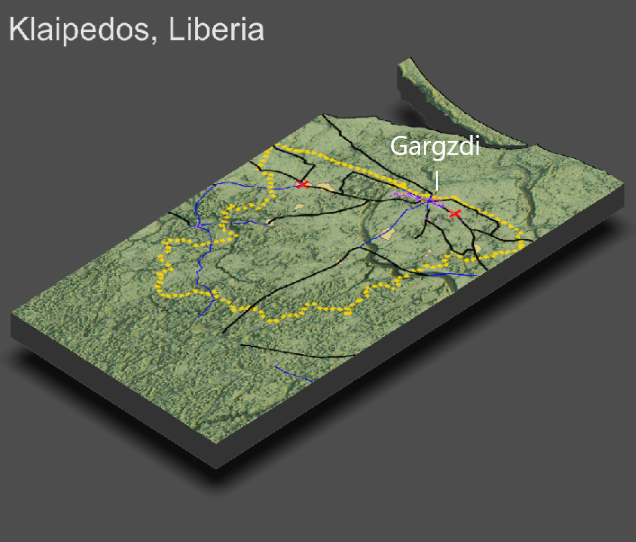

# Final Project

## Accessibility 1
For the first part of this project, I chose an adm2 region to use. I decided to use the region of Klaipedos, in the adm1 region of Klaipedos, as the population size seemed adequate for this assignment. Due to difficulty with R filtering by the name due to its special charactersitics, I had to filter the data by a different variable associated with the region, though it functioned the same. Once I defined my region, I plotted the most densely populated areas and highlighted them, removing the excess land. Then, I assigned urban areas and created a map with a legend indicating the population and density of the given cities.

## Accessibility 2
For the second part, I downloaded data pertaining to Lithuanian roadways and medical facilities. I similarly cropped these to just my Klaipedos region before sorting them into their various sorts (primary road vs unknown and the different types of medical facilities). Then, I overlayed these onto the map to create a map of roadways and medical facilities in Klaipedos. 

## Accessibility 3
For the final part of this project, I created a 3D map of all that I had previously modeled. The key part of this was making the density highlights, roadways, and hospitals into a separate overlay. Then, I created a 3D render of the map and placed this overlay onto it. Finally, I labeled one of the primary economic cities, Gargzdi. 

