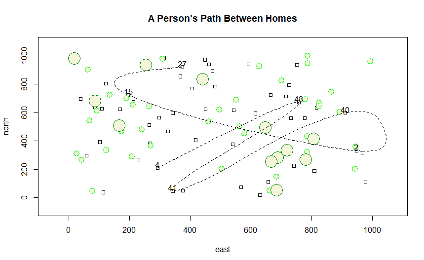

# Challenge Question

To make this plot, I used similar code to the complex plot, but changed some of the values. I changed the x and y  values to be from 1 to 1000, the number of squares to 50, the number of small circles to 40, and the number of large circles to 12. I also had to resize each of the shapes to be proportional to the size of the plot. I experimented a bit with the sizings, but found that a value of 10 worked for the smaller shapes and a 20 for the larger circles. Then, I adjusted the locs and dwellings to create an id for all 50 square dwellings and to choose 7 of the 50 as ones that the traveller "stops at." Once these 7 dwellings were selected and labeled, I used the x spline to create a path between them. 

