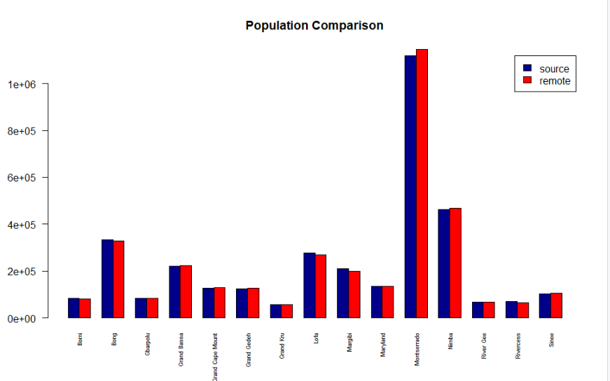
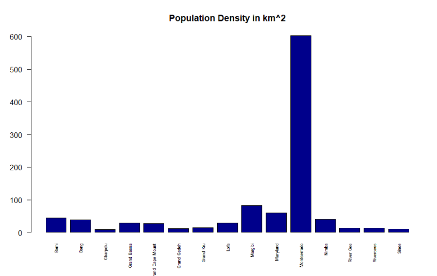
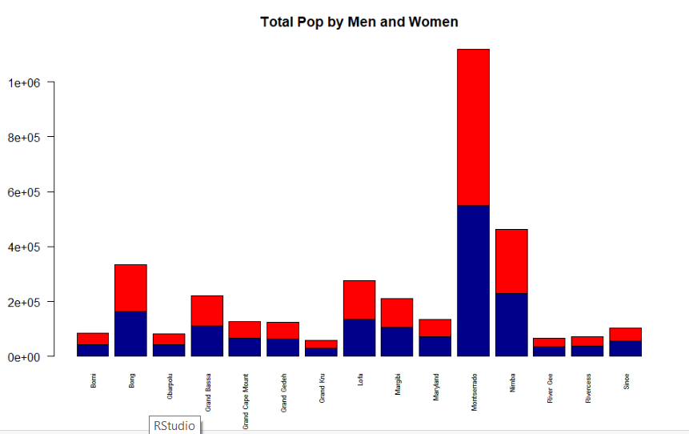
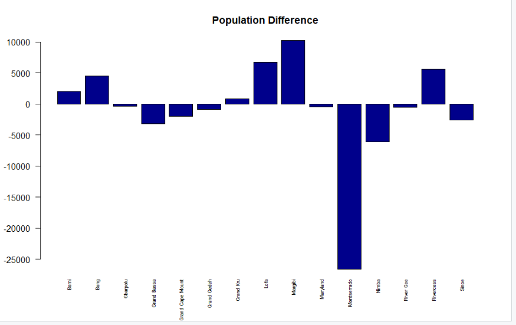

# Data Management Basics

For this assignment, I created numerous bar plots comparing the data of two sources for population make ups in various cities in Liberia. I first imported both data sets from my working repository into RStudio. Then, I reformated and renamed aspects of the charts so that they were comparable. Next, I created additional columns on one data set that consisted of various comparisons, such as differences in total population estimates, percentage of women, as well as the population density recorded by one data set. Then I created various barplots in order to chart this information. 

