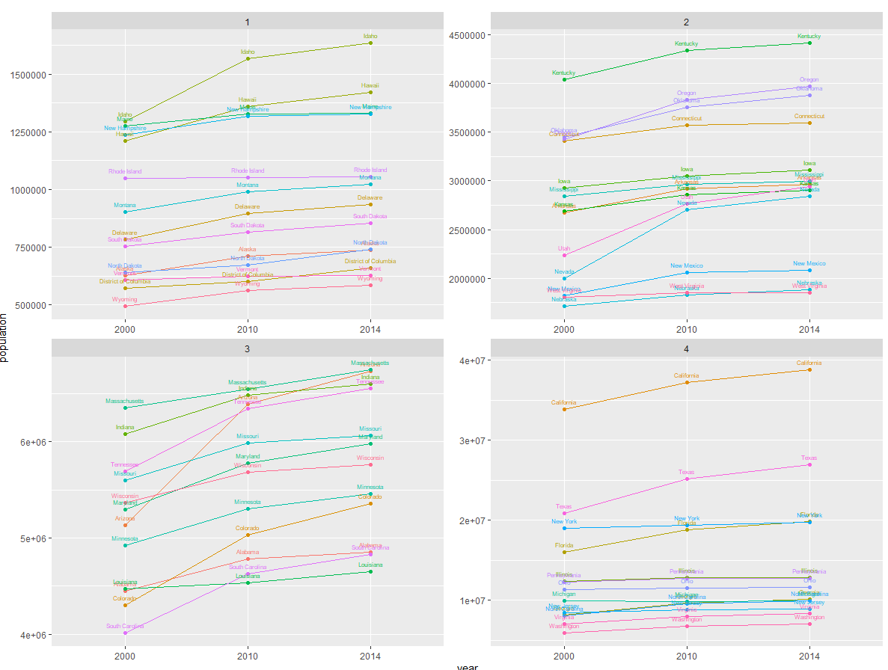
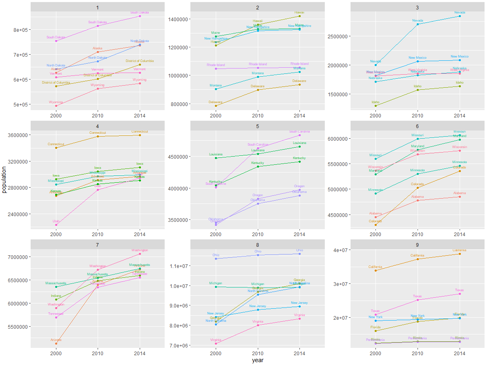

# Project 1 Part 2

Below are the four graphs I created to plot population in each US state (as well as the District of Columbia) in the years 2000, 2010, and 2014. I created this by importing data from the US Census Bureau. Then, I ordered the data so that all three data sets were able to be effectively matched up and binded them together. From there, I convereted the data into a long format and developed a single plot, before splitting it into four easier to read ones. 

# Stretch Goal

For the stretch goal, I used the same data, but instead created 9 different plots formatted into a 3x3 grid. 

