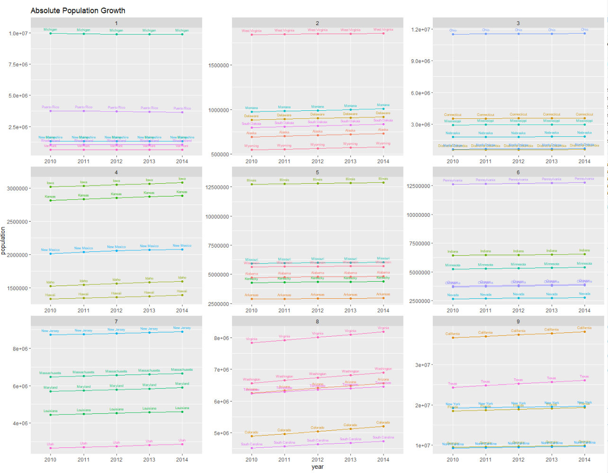
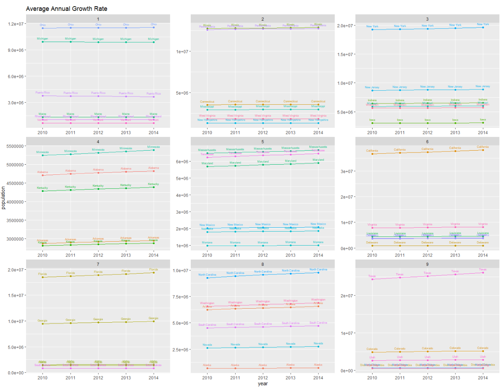

# Project 2 Part 1

I first used data from the US census to create a data fram of the population in 52 US regions from the years of 2010-2015. I added columns looking at the total change over that time, as well as the average yearly growth rate over the time span. In addition, I used the within() function in order to split the regions into 9 equal quantiles based on their results for each calculation. After that, I created a 3x3 set of plots to chart the changes over time for each quantile. The first graph shows the absolute population increase over time, while the second set of plots show the average annual growth rates.

## Absolute Population Increase

## Average Growth Rate

